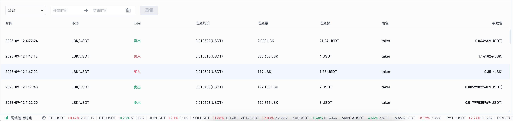
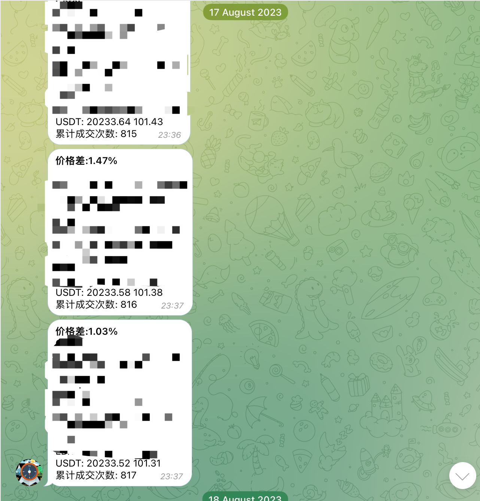

# trading-bot 套利交易机器人

Arbitrage trading robot based on websocket
基于 websocket 实现的套利交易机器人

## Transactions 交易记录

Partial trade records 部分交易记录

## Features

### Socket Based Super Fast 基于 socket 实现，速度快

### Emergency Stop Loss 紧急止损

When the loss exceeds x%, the transaction will be automatically stopped and notified by TG

### Customized Profit Range 自定义利润区间

Initial range `>= 1%`

### Telegram Real Time Notification (TG 交易通知)

## Profit 收益

The following graph are included the value fluctuations. Every single trade profit is 3%-10%
以下数据包含代币本身价值波动，套利交易单次利润在 3%-10% 左右

## Cooperation 合作

[📬 rosendofun@gmail.com](rosendofun@gmail.com)

### Private deployment 私有化部署

### Trading profit sharing 交易利润分成
